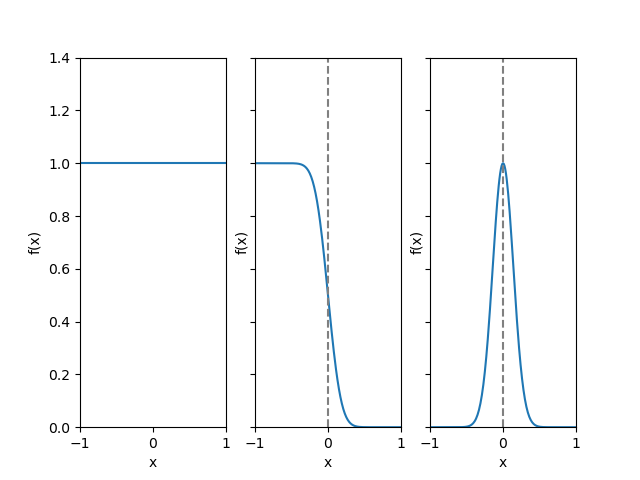
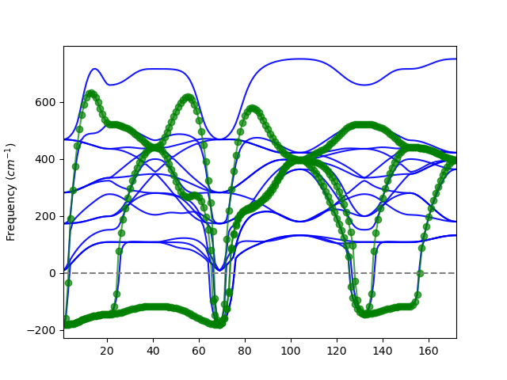
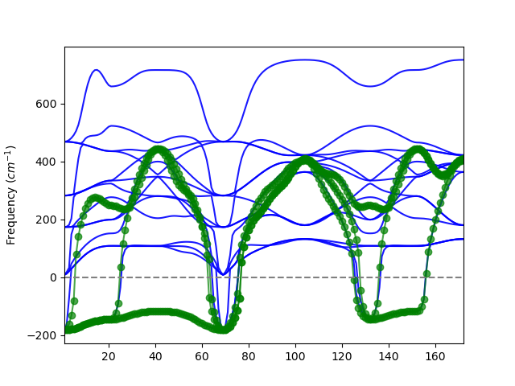

# Tutorials on constructing Lattice Wannier functions (LWF's). 

This tutorial introduces the methods for constructing lattice Wannier funtions (LWF's)(reference: [[cite:rabe1995]] ). You'll learn how to use the SCDM-k (selected columns of the density matrix in k-space) (references: [[cite:damle2015]] [[cite:damle2017]] and [[cite:damle2018]] ) method for constructing the LWF's. And how to plot the band structure of the LWF's and compare it with the full phonon band structures. 

The LWF is a close analogy to the electron Wannier functions.  Each LWF is formed by a group of atomic displacement within a certain range. Together they form a localized basis set for the atomic distortions, which could span the (sub)space for the atomic vibrations (phonons). One typical use case is to build effective Hamiltonian of atomic displacement. In many phenomenons, only a few distortion modes are important. For example,  in a structural phase transition the soft modes are often related, whereas the phonons with much higher frequency are probably less relevant. Thus if the LWF's can well represent the relevant phonon modes, it could reduce the number of degrees of freedom in the study of such phenomenons. 

In anaddb, LWF's could be constructed with the SCDM-k algorithm or the projected Wannier function (PWF) algorithm. Both methods were initially proposed for electron Wannier functions and were adapted for the LWF's. In this tutoral, we'll first learn about the algorithms and the practical usage of the methods. 


## SCDM-k method

### Introduction to the SCDM-k algorithm

The SCDM-k method is based on two observations: 1. The columns of the density matrices (DM) are often localized, given that the DM is expressed in local basis set. 2. The DM are often low ranked, i.e. they can be spanned by basis set with size smaller than the original basis set.  A $m\times n$ matrix $\mathbf{A}$ can be approximately decomposed as another matrix formed by its columns, a $m\times k$ matrix $\mathbf{A[:,c]}$ multiplied by a $k\times n$ matrix, and a permutation matrix $\Pi$ with size $n\times n$. The matrix  $\mathbf{A[:,c]}$  is selected so that it best represent the $\mathbf{A}$ matrix. Thus it can be used as a basis set for describing $\mathbf{A}$. In our case, it can be used as the Wannier function. 


The DM are defined as $\mathbf{\rho}=\sum_i \Psi_if(E_i)\Psi_i^\dagger$,where $H\Psi_i=E_i\Psi_i$,  where $E_i$ and $\Psi_i$ are the eigen energy and eigen function of the Hamiltonian, and $f$ is the occupation function, which is often defined as the Fermi function for  the electrons. Thus the DM contains information from where the $f$ is large, whereas neglecting the information where the $f$ is close to 0. Thus, if the LWF can effectively span the DM, it is good for describing the physics with in the range where $f$ is significant. This makes $f$ effectively an disentanglement function, which encodes the energy range of interests. Instead of using the Fermi function, we can take other functions so that we can select other kinds of energy range, thereby gives the "generalized DM". In anaddb, three kinds of functions could be used corresponding to the "lwf_disentangle" paramter in anaddb, as shown in the figure below.

- The unity function, which is 1 everywhere. This means all the energies are treated equally. 
- The erfc function, which is very similar to the Fermi function with two parameters, $\mu$ and $\sigma$. It approaches 1 and 0 below and above $\mu$, respectively. And the smearing of the function is defined as $\sigma$. For example the center panel of the figure is $\mu=0$ and $\sigma=0.2.  This type of function is often used to build LWF's where the low frequency phonons are of interests.  
- The Gauss function which is highest at the center ($\mu$) and close to 0 away from it. The width is defined by $\sigma$. The right panel shows the function with $\mu=0$ and $\sigma=0.2$. This type of function is often used if the phonon within some energy range are of interests. 



More generally, the function $f$ does not have to be solely a function of the $E_i$. For example, it can also take the $\Psi_i$ as input. We can define a few states as "anchor states", and project the states onto them, and multiply the $f$ by this projection, so that the eigenstates which are most similar to the anchor states are emphasized. This method can be very useful when the phonon modes of interests can hardly be distinguished from other modes by energy.  In anaddb this can be enabled by setting lwf_anchor_proj to 1. 

In the case of a periodic crystal, the columns density matrices for all wave vector is localized and  are continuous in reciprocal space. Therefore by transform these columns to the real space, one could get localized functions.  In practice, we start from finding the columns of the DM for an anchor $q$-points. Then we take the same columns for each wave vector $q$ in an Monkhorst-Pack grid. As these columns are smooth in reciprocal space, the transformations to real space are localized.  The size of the Monkhorsrt-Pack grid can be specified by "lwf_ngqpt". Note that it does not have to be the same as the "ngqpt", as we can use a different $q$-points grid by interpolating the inter-atomic force constant.  

### Steps to construct the LWF usign SCDM method

Now we take BaTiO$_3$ as an example to learn how to construct the LWF's with the SCDM method. 


 You can download the DDB file for the BaTiO$_3$  here:*

and the anaddb input file:


**Before starting, you might to consider working in a different subdirectory than for the other lessons. Why not create "Work_LWF"?**

We can walk through the following steps to build the LWF.

1. Turn on the options required for the construction of LWF's. The interatomic force constants should first be computed, which requires "ifcflag 1" and a few parameters related as in the "Inter-atomic force constant info" section in the input file below. To enable the construction of LWF's with the SCDM-k method, the "lwfflag 1" is used.

2. Identify the phonon modes of interests. 

    In the example of BaTiO$_3$, as we're interested in the ferroelectricity which is related to the three soft modes at $q=\Gamma$.  We can selected $\Gamma$ as the anchor points with "lwf_anchor_qpt 0 0 0" and the number of wannier function to be 3 with the option "lwf_nwann 3" 

3. Identify the disentanglement function.  

   The lwf_disentangle parameter is set to 1 to use the "unity" function. We'll tune this to see the effect of using different disentanglement functions. 

   We can also enable the projection to the anchor points with "lwf_anchor_proj 1". The anchor points, is given by the indexes of the band at the anchor $q$-point ("lwf_anchor_iband"), which counts from the lowest frequency.

   The example anaddb input looks like follows:

```
!File paths
 ddb_filepath = "BTO.DDB"
 output_file = "tlwf_1.abo"

!Flags
 ifcflag 1
 lwfflag 1

# Interatomic force constant info 
 ngqpt 4 4 4
 q1shft 0 0 0
 nqshft 1
 asr 2
 chneut 1
 dipdip 0
 dipquad 0
 quadquad 0

# Lattice Wannier function parameters
 lwf_nwann 3
 lwf_ngqpt 4 4 4
 lwf_anchor_qpt  0 0 0
 lwf_anchor_iband 1 2 3
 lwf_disentangle 1
 lwf_anchor_proj=1                                                                    

```

4. Plot the phonon band structure and tune the parameters to get the desired set of LWF's.  

   If a q-point path is given in the anaddb input, an lwf_PHFRQ files are generated together with the usual PHFRQ file containing the phonon frequency. The format of the two files are the same. The only difference is that, the number of bands equals the number of Wannier functions whereas it is 3 times the number of atoms in the full phonon band structure.  Below is an example of the input to specify the q-point path. We can add these lines to the input to get the full and LWF phonon band structures. 
   
```
    ndivsm 20
    nqpath 8
    qpath
       0.0    0.0    0.0
       0.0    0.5    0.0
       0.5    0.5    0.0
       0.0    0.0    0.0
       0.5    0.5    0.5
       0.0    0.5    0.0
       0.5    0.5    0.0
       0.5    0.5    0.5
   
```

   

   We can use the script provided in the scripts/post_processing directory in the ABINIT package, named compare_phbands.py to plot the two band structure in one figure.  The detailed guide for the usage of the script can be found by the command:

```
   python compare_phbands.py --help
```

   Here we can use the command to generate the figure, both into the file compare.png and to the screen.

```
    python compare_phbands.py tlwf_1  -o compare.png -s
```


We can see the two band structures. The blue lines are the full phonon band structure and the green dots are the LWF phonon band structure.

   

   It shows that the LWF's follows the phonon branches connected with the three soft modes, and goes to high frequencies. 

The LWF's are not unique. They can be adapted to different purposes.  For example, we could use a disentanglement function which emphasis the low frequency part. Here we try with a erfc function with $\mu=400 cm^{-1}$ and a smearing of  $\sigma=150cm^{-1}$.

```
lwf_disentangle 2
lwf_mu 400.0
lwf_sigma 150.00
```

This give the band structure, which is similar in the low frequency but are significantly different in the high frequency.  For 


